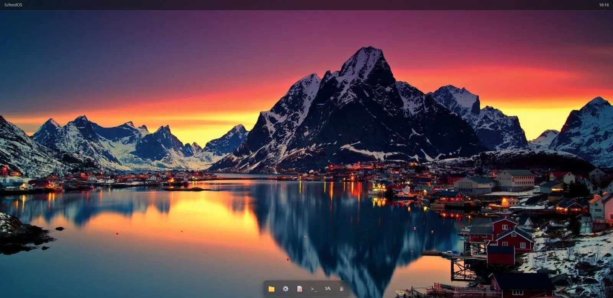

# SchoolOS



A simple web-based desktop made with HTML, CSS and JavaScript.

I made SchoolOS because I thought it would be fun to make something that feels like a little operating system.

It has draggable windows and different apps that you can open from the desktop.

What it has

• Draggable windows
• Different apps
• Drawing app
• Desktop and taskbar
• Dark interface
• Works in the browser

How I made it

SchoolOS is made with plain HTML, CSS and JavaScript. I didn’t use a big framework for the main interface.

The main files are:

• index.html
• script.js
• style.css

How to run it

Download or clone the repository, then open index.html in your browser.

You can also use a local server:

```bash
python3 -m http.server
```

Then open http://localhost:8000 in your browser.

Made by

Foxiified

Made for Hack Club.
